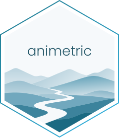

---
format:
  gfm:
    # Without this, pandoc appends ".png" to extensionless image URLs and every
    # shields.io / R-universe badge in this README breaks.
    default-image-extension: ""
knitr:
  opts_chunk:
    fig.path: "man/figures/README-"
---

<!-- README.md is generated from README.qmd. Please edit that file -->

```{r, include = FALSE}
knitr::opts_chunk$set(
  collapse = TRUE,
  comment = "#>",
  out.width = "100%"
)
# install.packages('animetric', repos = c('https://animovement.r-universe.dev', 'https://cloud.r-project.org'))
```


# animetric <a href="https://animovement.dev/animetric/"></a>
<!-- badges: start -->
[](https://doi.org/10.5281/zenodo.17818613)
[](https://github.com/animovement/animetric/actions/workflows/R-CMD-check.yaml)
[](https://animovement.r-universe.dev)
[](https://codecov.io/gh/animovement/animetric)
[](https://animovement.zulipchat.com)
<!-- badges: end -->

*An R package for calculating movement-based metrics*

The primary aim of the *animetric* package is to provide methods for calculating movement-based metrics, including kinematics, navigational statistics, and social interaction measures.

## Installation

You can install the development version of *animetric* with:

```{r, eval=FALSE}
install.packages('animetric', repos = c('https://animovement.r-universe.dev', 'https://cloud.r-project.org'))
```

Once you have installed the package, you can load it with:

```{r, eval=FALSE}
library("animetric")
```


## Citation {#citation}

If you enjoy the package, please make sure to cite it. If you find a bug, feel free to open an issue. 

To cite *animetric* in publications use:

```{r}
citation("animetric")
```
